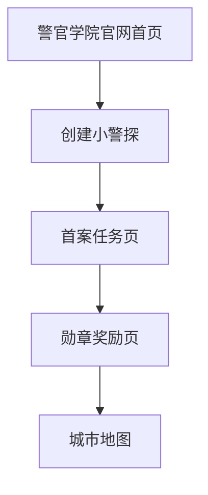
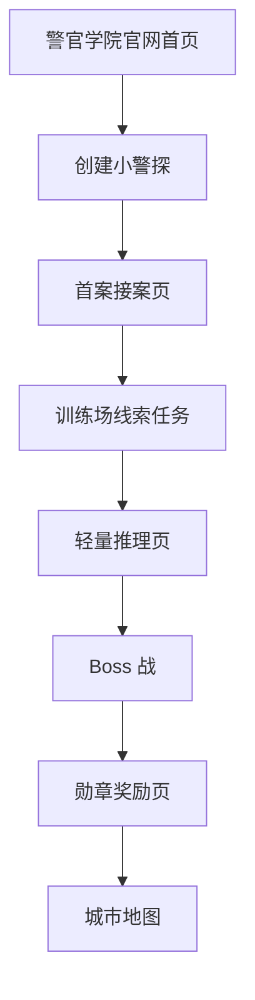

# 信息架构草案

状态：页面流程待确认  
用途：定义孩子从首页到首案通关的页面路径、每页职责、主操作和状态。

## 1. 已确认输入

来自前序文档的已确认内容：

- 首页入口：警官学院官网招募页。
- MVP 核心：完整破案学习闭环。
- 首案：导航机器人迷路案。
- 首案导师：牛局长 / 牛队长。
- 首案学科：数学，方向与位置。
- 首案题库：8 道题已通过审核。
- 首案结案奖励：导航修复勋章 + XP + 城市地图解锁。
- 首案通关后：先看勋章，再前往城市地图。
- 城市地图首屏：展示 3 个区域，中央广场开放，另外 2 个锁定。

## 2. 页面流程候选

以下流程尚未确认。

### 候选 A：极简 5 步



优点：

- 开发最快。
- 路径最短，孩子不容易迷路。

风险：

- 接案、推理、Boss 的仪式感不足。
- 不利于表达“完整破案学习闭环”。

### 候选 B：标准 8 步



优点：

- 能完整表达招募、入学、接案、线索、推理、Boss、奖励、地图解锁。
- 每个页面职责清楚。
- 后续其他案件可复用。

风险：

- 页面和状态多一些。
- 每页文案必须短，避免流程显得拖。

### 候选 C：剧情增强 10+ 步

说明：

- 每个线索任务都单独成页。
- 单独增加线索板、结案报告、导师评价、城市解锁动画等页面。

优点：

- 剧情感和仪式感最强。

风险：

- MVP 过重。
- 二年级孩子第一次试玩可能还没进城市地图就疲劳。

我的建议：候选 B。

## 3. 标准 8 步页面职责草案

以下按候选 B 展开，待确认。

### P1 警官学院官网首页

页面目的：

- 建立“我要加入警官学院”的动机。
- 让孩子知道这是一个破案学习游戏。
- 引导点击“加入警官学院”。

核心内容：

- 警官学院招募标题。
- 牛局长 / 牛队长或学院视觉。
- 一句话说明：加入学院，学习本领，破解案件。
- 主按钮：加入警官学院。

不做：

- 不堆成人化课程介绍。
- 不放大量长文。
- 不展示太多未开放功能。

### P2 创建小警探

页面目的：

- 让孩子完成入学身份创建。
- 建立“我是小警探”的参与感。

核心内容：

- 昵称输入。
- 头像选择。
- 年级默认二年级，可显示不可编辑或轻量选择。
- 主按钮：开始入学训练。

待确认：

- MVP 是否必须有昵称输入。
- 头像是否使用动物头像，还是先用默认头像。

### P3 首案接案页

页面目的：

- 牛局长 / 牛队长发布“导航机器人迷路案”。
- 告诉孩子本案目标和奖励。

核心内容：

- 案件标题：导航机器人迷路案。
- 导师短话：训练场的导航机器人迷路了，需要你用东南西北帮它找回路线。
- 奖励预告：导航修复勋章。
- 主按钮：进入训练场。

### P4 训练场线索任务

页面目的：

- 承载 Q1-Q4 四个线索任务。
- 让孩子在路线节点图上完成方向学习。

组织方式候选：

- A. 一个任务页内连续闯关。
- B. 每个线索一个小场景页。
- C. 地图节点即任务入口。

我的建议：

- 产品体验按 C 设计：训练场地图节点是任务入口。
- 技术实现可先按 A：同一任务页内逐题切换，用地图高亮模拟节点推进。

核心内容：

- 训练场路线节点图。
- 当前任务题干。
- 方向按钮 / 地图节点点击 / 选择项。
- 牛局长提示。
- 已获得线索显示。

### P5 轻量推理页

页面目的：

- 让孩子看到自己收集的线索。
- 做 1 个简单原因判断。

核心内容：

- 轻量线索板：方向灯、路线芯片 1、路线芯片 2、故障原因线索。
- 推理题：机器人为什么迷路？
- 主按钮：准备修复机器人。

待确认：

- 是否需要独立线索板页面，还是嵌在推理页。

### P6 Boss 战

页面目的：

- 用 3 道综合方向题修复混乱导航机器人。
- 让孩子感到“我用知识打败了问题”。

核心内容：

- 混乱导航机器人视觉。
- Boss 进度：3 段修复进度。
- 当前 Boss 题。
- 答错后牛局长提示，可重试。
- 成功后路线灯全部亮起。

### P7 勋章奖励页

页面目的：

- 展示通关反馈。
- 强化孩子的成就感。
- 引导前往城市地图。

核心内容：

- 导航修复勋章。
- XP 获得。
- 牛局长结案鼓励。
- 城市地图已解锁提示。
- 主按钮：前往城市地图。

### P8 城市地图

页面目的：

- 展示首案后的成长结果。
- 让孩子看到下一阶段进入动物城办案。

核心内容：

- 3 个城市区域。
- 中央广场开放。
- 另外 2 个区域锁定。
- 中央广场有下一案入口或“即将开始”提示。

待确认：

- 2 个锁定区域名称。
- 是否显示导师推荐任务。

## 4. 导航与返回规则草案

待确认：

- 首页可以进入入学流程。
- 入学后进入首案接案页。
- 首案中允许返回接案页，但不建议频繁跳出。
- 线索任务中刷新后应保留当前进度。
- Boss 战中答错不退出。
- 奖励页主按钮进入城市地图。
- 城市地图可回看勋章，但首版可后置。

## 5. 状态字段草案

```ts
type FirstLoopProgress = {
  hasCreatedCadet: boolean;
  currentPage:
    | 'home'
    | 'enrollment'
    | 'case-briefing'
    | 'clue-task'
    | 'reasoning'
    | 'boss'
    | 'reward'
    | 'city-map';
  firstCaseStatus: 'locked' | 'available' | 'in_progress' | 'completed';
  currentQuestionId?: string;
  collectedClues: string[];
  bossStep: 0 | 1 | 2 | 3;
  unlockedMedals: string[];
  unlockedDistricts: string[];
};
```

## 6. 页面验收标准草案

首页：

- 10 秒内能看懂“加入警官学院”。
- 主按钮明确。
- 不出现大量成人化介绍。

入学：

- 二年级孩子能独立完成。
- 昵称不是强制真实姓名。

首案任务：

- 每屏只有一个主要任务。
- 地图、题干、操作按钮不互相遮挡。
- 答错有提示，可继续尝试。

奖励页：

- 勋章是第一视觉焦点。
- 明确告诉孩子城市地图已解锁。

城市地图：

- 中央广场开放态明显。
- 锁定区域不会误导孩子以为已可进入。

## 7. 待确认问题

需要项目负责人继续拍板：

1. 页面流程采用 A、B、C 哪个候选。
2. 线索任务页面采用 A、B、C 哪种组织方式。
3. 是否使用“轻量线索板嵌在推理页”。
4. 创建小警探是否必须输入昵称。
5. 城市地图另外 2 个锁定区域名称。

